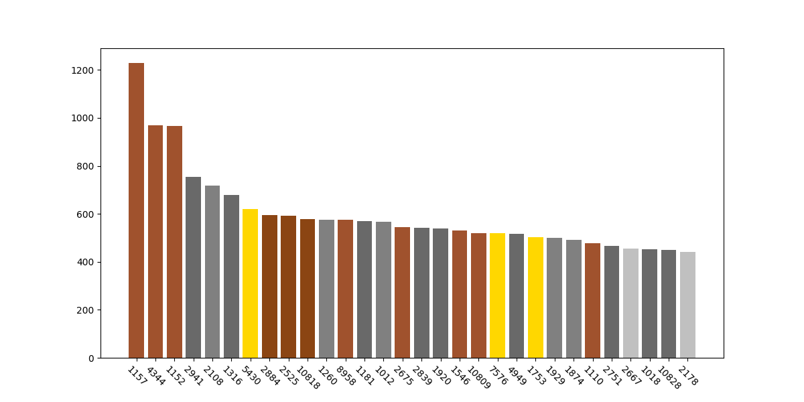

# 분석 그리고 통찰

## 요약

1. 이 책의 내용은 프로그래밍 자체와는 크게 관련이 없을 수 있다.
2. 쉽든 어렵든 문제는 생긴다.

사람들은 과연 어떤 질문을 가장 많이 할까요? 자주 언급되는 이슈는 무엇이 있을까요? 막연하게 생각나는 것들은 있을 수 있지만, 정확하지는 않을 겁니다. 질문게시판에 자주 답변을 달아주면서 나름대로 몇 가지 패턴을 찾긴 했습니다. 하지만 보다 정확한 결과를 얻기 위해 몇 가지 통계를 내보기로 했습니다.

백준 질문게시판의 질문들을 통계에 활용했습니다. 대략 10만 개가 넘는 질문글이 올라와 있지만, 유의미한 결과를 얻기에 큰 크기는 아니며 질문과 답변이 프로그래밍 학습에 필요한 영역과 크게 관계가 없을 수도 있습니다.

이 데이터를 분석해서 얻을 수 있는 것은 고작해야 **코딩테스트 문제를 풀면서 생기는 문제과 그 해결책**의 일부분입니다. 이 점을 우선 기억해주시기 바랍니다. 실무 단계에서 생기는 문제와 답변은 `stackoverflow`를 비롯한 커뮤니티가 충분히 활성화되어 있는 등, 더 좋은 자료로 활용할 수 있는 것이 많이 있지만, 이 책에서는 다루지 않습니다.

## 질문이 많은 문제

개별 문제들을 봤을 때, 최대 질문 수는 2024년 4월 말 기준으로는 1226개입니다. 그 다음으로도 1000개에 가까운 질문이 올라온 문제들이 있지만, 그 수는 빠르게 감소하여 400 대로 떨어집니다.

## 그래서 무엇이 문제인가?
